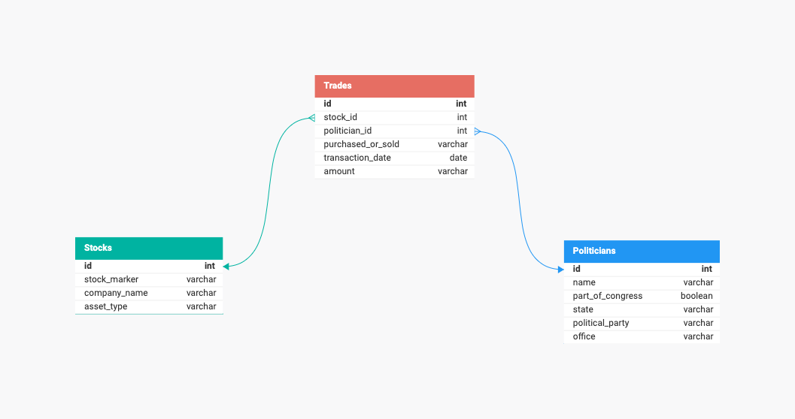

* Project Description Coming Soon *

<h1>Congress Trades Tracker</h1>

<h2>Pipeline</h2>

<h2>DB Model</h2>

<h2>Tech Used</h2>
    <ul>
        <li>Python</li>
        <li>AWS</li>
        <li>Pandas</li>
        <li>Flask</li>
        <li>PostgreSQL</li>
        <li>Pytest</li>
        <li>Prefect</li>
        <li>Selenium</li>
        <li>Beautiful Soup</li>
        <li>PyPDF</li>
        <li>Camelot</li>
        <li>Streamlit</li>
    </ul>

<h2>Optimizations/To Do List</h2>
    <ul>
        <li><s>Refactor SQL Alchemy into current API/ORM configuration</s></li>
        <li>Adjust Senate scraper calendar dates to align with Prefect scraping schedule</li>
        <li>Additional tests for House and Senate adapters</li>
        <li>Integrate LLM (Hugging Face Model) into Streamlit dashboard</li>
        <li>Add all PDF links for House trade reports to database</li>
    </ul>

<h2>Lessons Learned</h2>