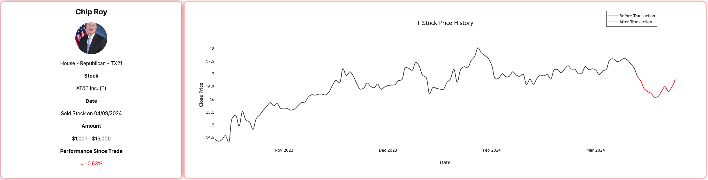
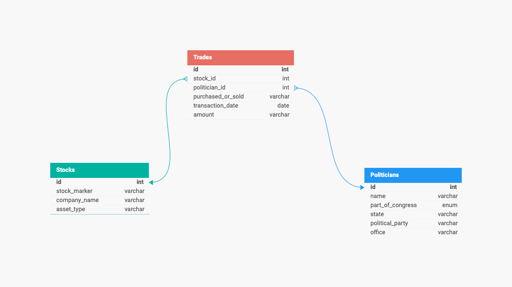

<h1>Congress Trades Tracker</h1>

Congress Trades Tracker is a project that aims to make congressional stock trading more transparent. There has been increased scrutiny on US Congress members stock activity, especially as it pertains to insider trading. This dashboard visualizes stock exchanges, shows performance returns, and highlights overall performance and activity on a member by member basis. The current product does not make direct connections between committee assignments or any other insider "knowledge" and individual stock exchanges. It does showcase the trade strategies of many incredibly wealthy politicians who often outperform the S&P 500 on a year to year basis. This allows the average stock trader or citizen to dig deeper into representatives' trade histories in search of fruitful strategies or nefarious activity. 

<h2>Installation</h2>

Pending instructions...

<h2>Pipeline</h2>

<a href="https://efdsearch.senate.gov/search/">Senate</a> and <a href="https://disclosures-clerk.house.gov/FinancialDisclosure">House</a> trades are stored on separate websites, with the House trades being much harder to extract given that the trade tables are stored on PDF documents. Separate Python scripts use Selenium and Beauitful Soup to scrape, transform (lightly), and write records to a Supabase DB. The records are then transformed with DBT to create integration and mart layers. The entire ELT process is Dockerized and run on a weekly schedule using AWS ECR, ECS, Fargate, and EventBridge.

<h2>DB Model</h2>

<h2>Main Tech Used</h2>
    <ul>
        <li>Python</li>
        <li>AWS</li>
        <li>Pandas</li>
        <li>DBT</li>
        <li>Flask</li>
        <li>PostgreSQL</li>
        <li>Pytest</li>
        <li>Prefect</li>
        <li>Selenium</li>
        <li>Beautiful Soup</li>
        <li>PyPDF</li>
        <li>React</li>
    </ul>

<h2>Lessons Learned</h2>
    <ul>
        <li>Extracting table data from PDFs can be really difficult. Ended up settling on PDFPlumber but also tried Camelot and Tabula. I want to look into utilizing Llamaparse in the future, especially to see if it can read some of the scanned images.</li>
        <li>Data Integrity is crucial to limiting edge cases. The number of politicians who use different iterations of their names in different places throughout these documents is incredible. For example, you could see William Cassidy, Bill Cassidy, and William Cassidy Jr between the uploaded documents, website tables, and Congressional records. I ended up using CASE WHEN statements in my DBT transformations to catch these mismatches but am looking for better alternatives still.</li>
    </ul>

<h2>Optimizations/To Do List</h2>
    <ul>
        <li><s>Refactor SQL Alchemy into current API/ORM configuration</s></li>
        <li>Use AWS Lambda to run scrape script instead of fargate/ecs?</li>
        <li>Add async to api/function calls so data is returned quicker</li>
        <li>Add check for matching politician by using two identifiers or some other metric (Two William Keatings, one from OH and one from MA)</li>
        <li>Add GitHub actions to run all tests on push to any branch</li>
        <li>Complete terraform file for ads database setup including resources, permissions, etc (host flask api on ec2, host frontend on ec2, make rds database)</li>
        <li>Go back to exact table positions in React Table upon clicking back button</li>
        <li>Finish React Frontend Main Components (front page graphs)</li>
        <li>Host Flask API on Cloud</li>
        <li>Adjust Senate scraper calendar dates to align with Prefect scraping schedule</li>
        <li>Additional tests for House and Senate adapters</li>
        <li><s>Integrate LLM (Hugging Face Model) into Streamlit dashboard</s>REVISE</li>
        <li><s>Add all PDF links for House trade reports to database</s></li>
    </ul>
